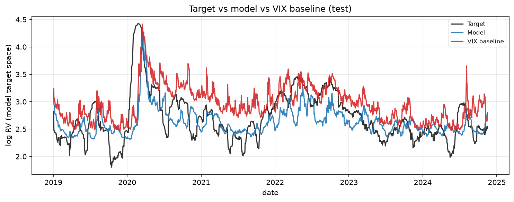
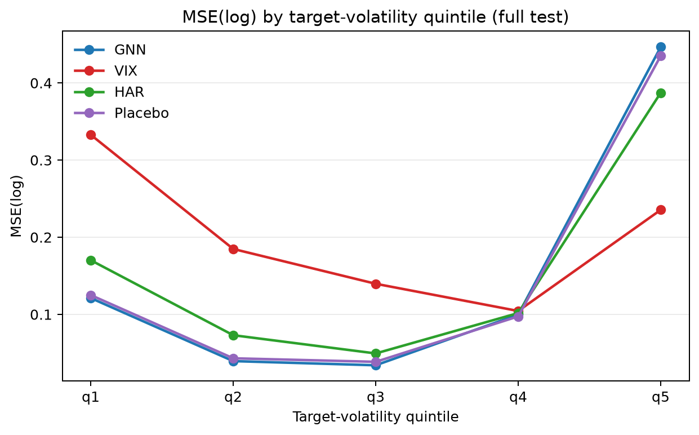

# CEMSPIMS

**Forecasting 30-day realized market volatility from equity return structure**

Reproducible research pipeline for the bachelor's thesis [*Forecasting 30-Day Realized Market Volatility Using Graph-Based Representations of Equity Return Structure*](docs/thesis/thesis.pdf) (Alexander Kokiauri, IE University, 2025–2026). [Executive summary](docs/thesis/executive-summary.pdf).

The pipeline asks whether **graphs built from U.S. equity return correlations** contain out-of-sample predictive information for **forward 30-trading-day realized volatility** on the S&P 500. A Graph Neural Network (GraphSAGE) produces one forecast per date. The **VIX is benchmark-only** — never a model input.

---

## Key findings (canonical 20-day specification)

| Comparison | Full test sample | Test excl. 2020 |
|------------|------------------|-----------------|
| GNN MSE(log) | **0.148** | **0.090** |
| VIX MSE(log) | 0.199 | 0.150 |
| HAR MSE(log) | 0.156 | 0.091 |

Formal inference (Newey–West HAC, defended thesis):

| Hypothesis | Question | Result (canonical) |
|------------|----------|-------------------|
| **H1** | Does the GNN forecast future RV? | Strong evidence (MZ slope, *p* ≈ 10⁻¹⁸) |
| **H2** | Does GNN beat VIX on forecast loss? | Mixed: MSE(log) *p* = 0.027; QLIKE not significant |
| **H3** | Incremental information beyond VIX? | Borderline (*p* ≈ 0.05) |
| **H4** | Robustness after stripping stress episodes | GNN advantage strengthens on several restricted samples |

The GNN performs especially well in **low- and medium-volatility** regimes; the VIX remains stronger in the **highest-volatility** quintile. The model is best viewed as a **complementary** risk signal alongside implied volatility, not a replacement.

Alternative rolling windows (63-day, 252-day) are available in `middle1.toml` and `yearwindow.toml`; the 20-day `default` specification remains canonical.





---

## Repository layout

```
├── configs/           # default (canonical), middle1 (63d), yearwindow (252d)
├── docs/              # thesis PDF, data guide, architecture, figures
├── scripts/run.py     # CLI entrypoint
├── src/mss/           # pipeline implementation (import as `mss`; PyPI-style name is `cemspims`)
└── tests/
```

**Not in git:** raw market data (`data/raw/`), per-run outputs (`data/<run_id>/`). See [docs/DATA.md](docs/DATA.md).

---

## Quickstart

**Requirements:** Python 3.11+

```bash
python -m venv .venv
.venv\Scripts\activate          # Windows
pip install -e ".[dev,train]"   # PyTorch + PyG for training steps
```

For GPU training, install a CUDA-enabled PyTorch build ([pytorch.org](https://pytorch.org/get-started/locally/)) before or after the editable install.

Place raw inputs under `data/raw/` (see [docs/DATA.md](docs/DATA.md)), then:

```bash
python scripts/run.py validate-config --run default
python scripts/run.py run --run default
```

Run a subset of pipelines:

```bash
python scripts/run.py run --run default --pipeline data.prepare --pipeline graph.prepare
python scripts/run.py list-pipelines
```

Configs map 1:1 to run ids: `configs/default.toml` → `data/default/`.

---

## Pipelines

| # | Pipeline | Purpose |
|---|----------|---------|
| 1 | `data.prepare` | Ingest CRSP/VIX → returns panel → 30-day RV targets |
| 2 | `graph.prepare` | 500-stock universe, rolling features, correlation edges |
| 3 | `dataset.package` | Chronological splits + train-only scaler |
| 4 | `model.cache_graphs` | Pre-materialize PyG graphs (`.pt`) |
| 5 | `model.train` | GraphSAGE training with early stopping |
| 6 | `model.evaluate` | Scoring, benchmarks, formal H1–H4 tests |
| 7 | `analysis.summarize` | Forecast and diagnostic figures |
| 8 | `thesis.export` | Curated manuscript tables/figures |

Steps resume automatically when outputs are complete; use `--overwrite <pipeline>` to force regeneration.

---

## Design principles

- No look-ahead leakage; strict chronological train / val / test splits
- VIX benchmark-only (never a GNN input)
- Placebo-graph ablation + HAR-like historical benchmark
- Config-driven robustness (`default`, `middle1`, `yearwindow`) — no duplicated code paths
- Explicit artifact contracts between steps ([`docs/data_contracts.md`](docs/data_contracts.md))

---

## Documentation

| Document | Description |
|----------|-------------|
| [docs/DATA.md](docs/DATA.md) | Raw data requirements |
| [docs/thesis/](docs/thesis/) | Defended thesis and executive summary |
| [docs/architecture.md](docs/architecture.md) | Module map and pipeline internals |
| [docs/data_contracts.md](docs/data_contracts.md) | Artifact schemas (developers) |

---

## Tests

```bash
python -m pytest tests/
python -m pytest -m train    # requires torch + torch-geometric
```

---

## Citation

If you use this code, please cite the thesis:

> Kokiauri, A. (2026). *Forecasting 30-Day Realized Market Volatility Using Graph-Based Representations of Equity Return Structure*. Bachelor's thesis, IE University.

---

## License

MIT — see [LICENSE](LICENSE). You may use, share, and modify the code with attribution; see the license file for the full legal text.

