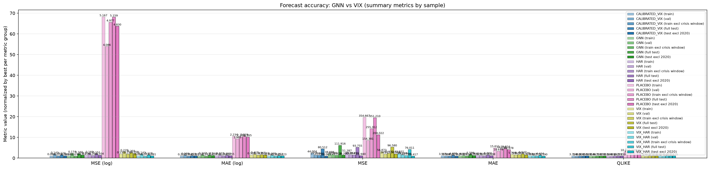

# CEMSPIMS

**Forecasting 30-day realized market volatility from equity return structure**

Reproducible research pipeline: a Graph Neural Network (GraphSAGE) produces one forward-volatility forecast per date from **graphs built from U.S. equity return correlations**. The **VIX is benchmark-only** — never a model input.

---

## Design (v2)

Canonical config: **`configs/default.toml`**. GPU scale preset: **`configs/scale_gpu.toml`**.

| Area | Choice |
|------|--------|
| **Target** | `log_rv_fwd_30cal` — forward **30-calendar-day** realized S&P vol, annualized by actual observation count (horizon-aligned with VIX). `log_rv_fwd_30` remains in `targets.parquet` for robustness only. |
| **Benchmarks** | `raw_vix` (primary H2/H3), plus `calibrated_vix`, `vix_har`, and standalone `har` as secondary benchmarks. |
| **Model** | 512×4 GraphSAGE (`lr = 1e-5`, 200 epochs, patience 15), weighted Spearman edges (`use_edge_weights = true`), six node features (rolling mean/vol, log dollar volume, turnover, downside semi-vol, skew). |
| **Universe** | Broad point-in-time **market-cap** cross-section (`selection_rule = mcap`, 500 nodes, `top_k = 10`). `dollar_volume` ranking and `sp500_membership` are optional robustness modes only. |

Formal inference (Newey–West HAC, test split):

| Hypothesis | Question |
|------------|----------|
| **H1** | Does the GNN forecast future RV? (Mincer–Zarnowitz) |
| **H2** | Does the GNN beat **raw VIX** on forecast loss? (Diebold–Mariano) |
| **H3** | Does the GNN add information **conditional on raw VIX**? |
| **H4** | Do results hold after pre-specified stress exclusions? |
| **H5** | Does the GNN beat a placebo-topology model? |
| **H2_benchmark / incremental_vs_benchmark** | Generalized DM / incremental tests vs secondary benchmarks |




## Results (default run)

Test-split point loss (`mse_log`, lower is better) on the promoted `default` config (512×4 GraphSAGE, `lr = 1e-5`):

| Model / benchmark | Test `mse_log` |
|-------------------|----------------|
| GNN | **0.160** |
| `har` | 0.151 |
| `vix_har` | 0.119 |
| raw VIX | 0.203 |

Formal tests (Newey–West HAC, test split): **H1** (Mincer–Zarnowitz) and **H5** (vs placebo topology) are significant. **H2** vs raw VIX on `mse_log` is borderline (p ≈ 0.05); QLIKE-based H2 is not significant. **H3** (incremental vs raw VIX) is not significant. The GNN beats raw VIX on point `mse_log` but **does not** beat the secondary `har` / `vix_har` benchmarks on test loss. See [docs/experiments.md](docs/experiments.md) for ablation runs.

---

## Repository layout

```
├── configs/           # default.toml (canonical), scale_gpu.toml, default_train_scale.toml (ablation)
├── docs/              # data guide, architecture, experiments
├── scripts/run.py     # CLI entrypoint
├── src/mss/           # pipeline implementation
└── tests/
```

**Not in git:** raw market data (`data/shared/raw/`), shared prepare (`data/shared/interim/`), per-run outputs (`data/<run_id>/`). See [docs/DATA.md](docs/DATA.md).

---

## Quickstart

**Requirements:** Python 3.11+

```bash
python -m venv .venv
.venv\Scripts\activate          # Windows
pip install -e ".[dev,train]"   # PyTorch + PyG for training steps
```

For GPU training, install a CUDA-enabled PyTorch build ([pytorch.org](https://pytorch.org/get-started/locally/)) before or after the editable install.

Place raw inputs under `data/shared/raw/` (see [docs/DATA.md](docs/DATA.md)), then:

```bash
python scripts/run.py validate-config --run default
python scripts/run.py run --run default
```

Branch a new experiment (no CRSP duplication):

```bash
python scripts/run.py branch --parent default --child my_ablation --at graph.prepare
python scripts/run.py list-runs
python scripts/run.py run-tree
```

Run a subset of pipelines:

```bash
python scripts/run.py run --run default --pipeline data.prepare --pipeline graph.prepare
python scripts/run.py list-pipelines
```

Configs map 1:1 to run ids: `configs/default.toml` → `data/default/`. Shared prepare lives in `data/shared/interim/`.

**Experiment graph app** (branch, jobs, compare in the browser):

```bash
pip install -e ".[app]"
cd app/web && npm install && npm run build
python scripts/run.py app
```

See [docs/app.md](docs/app.md). After CLI-only runs, sync graph state with `python scripts/sync_app_state.py --reload` (app must be running).

---

## Pipelines

| # | Pipeline | Purpose |
|---|----------|---------|
| 1 | `data.prepare` | Ingest CRSP/VIX → returns panel → targets |
| 2 | `graph.prepare` | Universe, node features, correlation edges |
| 3 | `dataset.package` | Chronological splits + train-only scaler |
| 4 | `model.cache_graphs` | Pre-materialize PyG graphs (`.pt`) |
| 5 | `model.train` | GraphSAGE training with early stopping |
| 6 | `model.evaluate` | Scoring, benchmarks, formal H1–H5 tests |
| 7 | `analysis.summarize` | Forecast and diagnostic figures |
| 8 | `thesis.export` | Curated exhibit tables/figures from run outputs |
| 9 | `analysis.compare_runs` | Optional cross-run comparison |

Steps resume automatically when outputs are complete; use `--overwrite <pipeline>` to force regeneration.

Evaluation outputs live under `data/<run_id>/processed/` (`scoring/`, `metrics/`, `figures/`, `tables/thesis/`).

---

## Design principles

- No look-ahead leakage; strict chronological train / val / test splits
- VIX benchmark-only (never a GNN input)
- Placebo-graph ablation + HAR / VIX benchmark suite
- Config-driven experiments via `branch` + one-knob TOML edits ([docs/experiments.md](docs/experiments.md))
- Explicit artifact contracts ([docs/data_contracts.md](docs/data_contracts.md))

---

## Documentation

| Document | Description |
|----------|-------------|
| [docs/experiments.md](docs/experiments.md) | Controlled experiment matrix and ablations |
| [docs/DATA.md](docs/DATA.md) | Raw data requirements and runtime reset |
| [docs/app.md](docs/app.md) | Experiment graph UI |
| [docs/architecture.md](docs/architecture.md) | Module map and pipeline internals |
| [docs/data_contracts.md](docs/data_contracts.md) | Artifact schemas |

---

## Tests

```bash
python -m pytest tests/
python -m pytest -m train    # requires torch + torch-geometric
```

---

## License

MIT — see [LICENSE](LICENSE).
